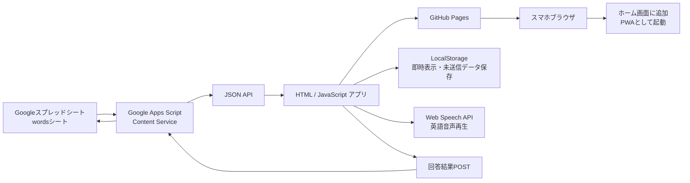

# 英単語クイズアプリ 仕様書

## 1. 目的

Googleスプレッドシートで管理している英単語データを読み込み、スマホブラウザから利用できる英単語クイズアプリを作成する。

スプレッドシートを更新すると、アプリ側にも最新の問題データが反映される構成とする。

また、クイズの正解・不正解の結果を同じ `words` シートに記録し、正解回数・間違い回数・苦手状態をスプレッドシート上で管理できるようにする。

GitHub Pagesで静的HTMLアプリとして公開し、PWA化することでスマホのホーム画面からアプリのように起動できるようにする。

---

## 2. 前提

このアプリは、個人利用または少人数利用を前提とする。

初期版では複数ユーザー利用は想定しない。

そのため、正誤情報はユーザー別に分けず、単語ごとに `words` シート上で集計する。

---

## 3. 全体構成



---

## 4. 採用技術

| 項目 | 技術 |
|---|---|
| 単語データ管理 | Googleスプレッドシート |
| API | Google Apps Script Content Service |
| フロントエンド | HTML / CSS / JavaScript |
| CSS | Tailwind CSS |
| 音声再生 | Web Speech API |
| 端末内保存 | LocalStorage |
| 静的ホスティング | GitHub Pages |
| PWA対応 | Web App Manifest / Service Worker |

---

## 5. システム概要

### 5.1 基本方針

アプリ本体は静的なHTMLファイルとして作成する。

問題データはHTML内に固定で持たず、アプリ起動時にApps ScriptのURLへアクセスし、Googleスプレッドシートの内容をJSON形式で取得する。

回答後は、正解・不正解の結果をApps ScriptへPOSTし、`words` シートの対象行を更新する。

```text
HTMLアプリ起動
↓
Apps Script APIへGET
↓
スプレッドシートの単語データをJSONで取得
↓
クイズ画面に反映
↓
回答
↓
Apps Script APIへPOST
↓
wordsシートの正誤カラムを更新
```

---

### 5.2 Apps Scriptの役割

| 役割 | 内容 |
|---|---|
| スプレッドシート読み込み | `words` シートの全行を取得 |
| データ整形 | 列名をキーにしたJSONへ変換 |
| 有効データ抽出 | `enabled = TRUE` または `enabled` 未入力の行だけ返す |
| 空行除外 | 必須項目が空の行を除外 |
| JSONレスポンス | Content ServiceでJSONを返す |
| 回答結果更新 | `doPost()` で対象行の正誤カラムを更新 |
| 集計値更新 | 正解回数・間違い回数・最終結果・苦手フラグを更新 |

---

### 5.3 フロントエンドの役割

| 役割 | 内容 |
|---|---|
| 問題データ取得 | Apps Script APIからJSON取得 |
| セクション分割 | 10問ごとにSectionを作成 |
| クイズ表示 | 穴埋め形式で出題 |
| 答え表示 | 正解単語と完成フレーズを表示 |
| 自己判定 | 「違った」「合ってた」で判定 |
| 苦手管理 | スプレッドシートの `is_weak` とLocalStorageを併用 |
| 回答結果送信 | Apps Script APIへPOST |
| 音声再生 | Web Speech APIで読み上げ |
| ステータス表示 | 未着手・マスター済み・残り苦手数を表示 |
| PWA対応 | manifest.json / service-worker.js を読み込み |

---

## 6. データ仕様

### 6.1 Googleスプレッドシート構成

シート名は以下とする。

```text
words
```

1行目はヘッダー行とする。

初期版では `learning_logs` シートは使用しない。

---

### 6.2 カラム定義

| カラム名 | 必須 | 型 | 説明 |
|---|---:|---|---|
| id | 必須 | string / number | 単語の一意ID |
| word | 必須 | string | 正解の英単語 |
| meaning_ja | 必須 | string | 英単語の日本語訳 |
| phrase_en | 必須 | string | 英語フレーズ |
| phrase_ja | 必須 | string | フレーズの日本語訳 |
| example_en | 任意 | string | 別文脈の英語例文 |
| example_ja | 任意 | string | 例文の日本語訳 |
| section | 任意 | string / number | セクション番号。未指定なら10問ごとに自動分割 |
| enabled | 任意 | boolean / string | TRUEまたは未入力の行を出題対象とする |
| correct_count | 任意 | number | 正解回数 |
| wrong_count | 任意 | number | 間違い回数 |
| last_result | 任意 | string | 最後の回答結果。`correct` / `wrong` |
| last_answered_at | 任意 | datetime / string | 最後に回答した日時 |
| is_weak | 任意 | boolean / string | 苦手フラグ。TRUE/FALSE |
| consecutive_correct_count | 任意 | number | 連続正解回数。初期版では任意 |

---

### 6.3 スプレッドシート例

| id | word | meaning_ja | phrase_en | phrase_ja | enabled | correct_count | wrong_count | last_result | last_answered_at | is_weak |
|---|---|---|---|---|---|---:|---:|---|---|---|
| 001 | discharge | 退院 | push back my discharge date | 退院日を延期する | TRUE | 3 | 1 | correct | 2026-05-15T10:00:00+09:00 | FALSE |
| 002 | swelling | 腫れ | help the swelling go down | 腫れを引かせる | TRUE | 1 | 4 | wrong | 2026-05-15T10:03:00+09:00 | TRUE |
| 003 | grateful | 感謝している | I’m truly grateful for them | 彼らに本当に感謝している | TRUE | 0 | 0 |  |  | FALSE |

---

### 6.4 ID仕様

`id` は必ず一意にする。

推奨形式：

```text
001
002
003
```

または、

```text
word_001
word_002
word_003
```

LocalStorageおよび回答結果POSTではこの `id` を使って対象単語を特定する。

そのため、運用開始後は既存行の `id` を変更しない。

---

### 6.5 正誤カラムの初期値

正誤カラムは、空でも動作するものとする。

Apps Script側で空欄の場合は以下のように扱う。

| カラム | 空欄時の扱い |
|---|---|
| correct_count | 0 |
| wrong_count | 0 |
| last_result | 空文字 |
| last_answered_at | 空文字 |
| is_weak | FALSE |
| consecutive_correct_count | 0 |

---

## 7. Apps Script API仕様

### 7.1 API概要

Apps Script Content Serviceを使用し、以下の2つの処理を提供する。

| メソッド | 用途 |
|---|---|
| GET | 単語データ取得 |
| POST | 回答結果保存 |

---

### 7.2 エンドポイント

Apps ScriptをWebアプリとしてデプロイしたURLを使用する。

```text
https://script.google.com/macros/s/{DEPLOYMENT_ID}/exec
```

---

## 8. GET API仕様

### 8.1 概要

`words` シートから出題対象の単語データを取得する。

---

### 8.2 HTTPメソッド

```text
GET
```

---

### 8.3 リクエストパラメータ

初期版ではパラメータなしで全有効データを返す。

キャッシュ回避用に、フロント側から任意で `t` を付与してよい。

```text
https://script.google.com/macros/s/{DEPLOYMENT_ID}/exec?t=1710000000000
```

`t` はApps Script側では使用しない。

---

### 8.4 正常レスポンス

```json
{
  "success": true,
  "updatedAt": "2026-05-15T12:00:00.000Z",
  "count": 3,
  "data": [
    {
      "id": "001",
      "word": "discharge",
      "meaningJa": "退院",
      "phraseEn": "push back my discharge date",
      "phraseJa": "退院日を延期する",
      "exampleEn": "She was discharged yesterday.",
      "exampleJa": "彼女は昨日退院した。",
      "section": "",
      "correctCount": 3,
      "wrongCount": 1,
      "lastResult": "correct",
      "lastAnsweredAt": "2026-05-15T10:00:00+09:00",
      "isWeak": false,
      "consecutiveCorrectCount": 1
    }
  ]
}
```

---

### 8.5 エラーレスポンス

```json
{
  "success": false,
  "message": "Failed to load spreadsheet data.",
  "data": []
}
```

---

### 8.6 データ変換ルール

| スプレッドシート列 | APIレスポンス |
|---|---|
| id | id |
| word | word |
| meaning_ja | meaningJa |
| phrase_en | phraseEn |
| phrase_ja | phraseJa |
| example_en | exampleEn |
| example_ja | exampleJa |
| section | section |
| correct_count | correctCount |
| wrong_count | wrongCount |
| last_result | lastResult |
| last_answered_at | lastAnsweredAt |
| is_weak | isWeak |
| consecutive_correct_count | consecutiveCorrectCount |

---

### 8.7 フィルタリングルール

以下の行のみ返す。

```text
enabled が TRUE
または
enabled が未入力
```

ただし、次の必須項目が空の場合は除外する。

```text
id
word
meaning_ja
phrase_en
phrase_ja
```

---

## 9. POST API仕様

### 9.1 概要

ユーザーが「◯ 合ってた」または「✕ 違った」を押したとき、対象単語の正誤情報を `words` シートに記録する。

---

### 9.2 HTTPメソッド

```text
POST
```

---

### 9.3 リクエスト形式

ブラウザからApps ScriptへPOSTする場合、CORSのプリフライトを避けるため、`Content-Type` は以下を推奨する。

```text
text/plain;charset=utf-8
```

本文はJSON文字列とする。

---

### 9.4 リクエストボディ

```json
{
  "wordId": "001",
  "result": "correct",
  "answeredAt": "2026-05-15T10:00:00+09:00"
}
```

---

### 9.5 リクエスト項目

| 項目 | 必須 | 内容 |
|---|---:|---|
| wordId | 必須 | 対象単語のID |
| result | 必須 | `correct` または `wrong` |
| answeredAt | 任意 | 回答日時。未指定の場合はApps Script側の現在日時を使用 |

---

### 9.6 正常レスポンス

```json
{
  "success": true,
  "wordId": "001",
  "result": "correct",
  "correctCount": 4,
  "wrongCount": 1,
  "lastResult": "correct",
  "lastAnsweredAt": "2026-05-15T10:00:00+09:00",
  "isWeak": false,
  "consecutiveCorrectCount": 2
}
```

---

### 9.7 エラーレスポンス

```json
{
  "success": false,
  "message": "Word not found: 001"
}
```

---

## 10. 正誤更新ルール

### 10.1 基本ルール

初期版では、以下のルールを採用する。

```text
間違えたら苦手にする
正解したら苦手を解除する
```

---

### 10.2 ✕ 違った場合

| カラム | 更新内容 |
|---|---|
| wrong_count | 現在値 + 1 |
| correct_count | 変更なし |
| last_result | `wrong` |
| last_answered_at | 回答日時 |
| is_weak | TRUE |
| consecutive_correct_count | 0 |

---

### 10.3 ◯ 合ってた場合

| カラム | 更新内容 |
|---|---|
| correct_count | 現在値 + 1 |
| wrong_count | 変更なし |
| last_result | `correct` |
| last_answered_at | 回答日時 |
| is_weak | FALSE |
| consecutive_correct_count | 現在値 + 1 |

---

### 10.4 将来拡張ルール

学習効果を重視する場合、将来的に以下のルールへ変更可能とする。

```text
間違えたら is_weak = TRUE
連続2回正解したら is_weak = FALSE
```

この場合、`consecutive_correct_count` を使用する。

初期版では「1回正解で苦手解除」とする。

---

## 11. Apps Script実装仕様

### 11.1 基本コード

```javascript
const SHEET_NAME = "words";

const COLUMN_MAP = {
  id: "id",
  word: "word",
  meaningJa: "meaning_ja",
  phraseEn: "phrase_en",
  phraseJa: "phrase_ja",
  exampleEn: "example_en",
  exampleJa: "example_ja",
  section: "section",
  enabled: "enabled",
  correctCount: "correct_count",
  wrongCount: "wrong_count",
  lastResult: "last_result",
  lastAnsweredAt: "last_answered_at",
  isWeak: "is_weak",
  consecutiveCorrectCount: "consecutive_correct_count"
};

function doGet(e) {
  try {
    const sheet = getWordsSheet();
    const values = sheet.getDataRange().getValues();

    if (values.length <= 1) {
      return createJsonResponse({
        success: true,
        updatedAt: new Date().toISOString(),
        count: 0,
        data: []
      });
    }

    const headers = values[0].map(h => String(h).trim());
    const rows = values.slice(1);

    const data = rows
      .map(row => rowToObject(headers, row))
      .filter(isEnabledRow)
      .filter(hasRequiredFields)
      .map(normalizeWordItem);

    return createJsonResponse({
      success: true,
      updatedAt: new Date().toISOString(),
      count: data.length,
      data
    });

  } catch (error) {
    return createJsonResponse({
      success: false,
      message: error.message || "Unknown error",
      data: []
    });
  }
}

function doPost(e) {
  try {
    const payload = JSON.parse(e.postData.contents || "{}");

    const wordId = String(payload.wordId || "").trim();
    const result = String(payload.result || "").trim();

    if (!wordId) {
      return createJsonResponse({
        success: false,
        message: "wordId is required."
      });
    }

    if (result !== "correct" && result !== "wrong") {
      return createJsonResponse({
        success: false,
        message: "result must be correct or wrong."
      });
    }

    const sheet = getWordsSheet();
    const values = sheet.getDataRange().getValues();

    if (values.length <= 1) {
      return createJsonResponse({
        success: false,
        message: "No data rows found."
      });
    }

    const headers = values[0].map(h => String(h).trim());
    const col = getColumnIndexes(headers);

    validateRequiredColumns(col);

    const target = findRowByWordId(values, col.id, wordId);

    if (!target) {
      return createJsonResponse({
        success: false,
        message: `Word not found: ${wordId}`
      });
    }

    const rowIndex = target.rowIndex;
    const row = target.row;

    const currentCorrect = toNumber(row[col.correctCount]);
    const currentWrong = toNumber(row[col.wrongCount]);
    const currentConsecutiveCorrect = toNumber(row[col.consecutiveCorrectCount]);

    const answeredAt = payload.answeredAt
      ? String(payload.answeredAt)
      : new Date().toISOString();

    let nextCorrect = currentCorrect;
    let nextWrong = currentWrong;
    let nextIsWeak = false;
    let nextConsecutiveCorrect = currentConsecutiveCorrect;

    if (result === "correct") {
      nextCorrect = currentCorrect + 1;
      nextIsWeak = false;
      nextConsecutiveCorrect = currentConsecutiveCorrect + 1;
    } else {
      nextWrong = currentWrong + 1;
      nextIsWeak = true;
      nextConsecutiveCorrect = 0;
    }

    setCellIfColumnExists(sheet, rowIndex, col.correctCount, nextCorrect);
    setCellIfColumnExists(sheet, rowIndex, col.wrongCount, nextWrong);
    setCellIfColumnExists(sheet, rowIndex, col.lastResult, result);
    setCellIfColumnExists(sheet, rowIndex, col.lastAnsweredAt, answeredAt);
    setCellIfColumnExists(sheet, rowIndex, col.isWeak, nextIsWeak);
    setCellIfColumnExists(sheet, rowIndex, col.consecutiveCorrectCount, nextConsecutiveCorrect);

    return createJsonResponse({
      success: true,
      wordId,
      result,
      correctCount: nextCorrect,
      wrongCount: nextWrong,
      lastResult: result,
      lastAnsweredAt: answeredAt,
      isWeak: nextIsWeak,
      consecutiveCorrectCount: nextConsecutiveCorrect
    });

  } catch (error) {
    return createJsonResponse({
      success: false,
      message: error.message || "Failed to save answer."
    });
  }
}

function getWordsSheet() {
  const sheet = SpreadsheetApp
    .getActiveSpreadsheet()
    .getSheetByName(SHEET_NAME);

  if (!sheet) {
    throw new Error(`Sheet not found: ${SHEET_NAME}`);
  }

  return sheet;
}

function rowToObject(headers, row) {
  const item = {};
  headers.forEach((header, index) => {
    item[header] = row[index];
  });
  return item;
}

function isEnabledRow(item) {
  const enabled = item.enabled;

  if (enabled === "" || enabled === null || enabled === undefined) {
    return true;
  }

  if (enabled === true) {
    return true;
  }

  return String(enabled).toUpperCase() === "TRUE";
}

function hasRequiredFields(item) {
  return item.id &&
    item.word &&
    item.meaning_ja &&
    item.phrase_en &&
    item.phrase_ja;
}

function normalizeWordItem(item) {
  return {
    id: String(item.id).trim(),
    word: String(item.word).trim().toLowerCase(),
    meaningJa: String(item.meaning_ja).trim(),
    phraseEn: String(item.phrase_en).trim(),
    phraseJa: String(item.phrase_ja).trim(),
    exampleEn: String(item.example_en || "").trim(),
    exampleJa: String(item.example_ja || "").trim(),
    section: item.section ? String(item.section).trim() : "",
    correctCount: toNumber(item.correct_count),
    wrongCount: toNumber(item.wrong_count),
    lastResult: String(item.last_result || "").trim(),
    lastAnsweredAt: String(item.last_answered_at || "").trim(),
    isWeak: toBoolean(item.is_weak),
    consecutiveCorrectCount: toNumber(item.consecutive_correct_count)
  };
}

function getColumnIndexes(headers) {
  const result = {};

  Object.keys(COLUMN_MAP).forEach(key => {
    const headerName = COLUMN_MAP[key];
    result[key] = headers.indexOf(headerName);
  });

  return result;
}

function validateRequiredColumns(col) {
  const required = [
    "id",
    "correctCount",
    "wrongCount",
    "lastResult",
    "lastAnsweredAt",
    "isWeak"
  ];

  required.forEach(key => {
    if (col[key] < 0) {
      throw new Error(`Required column is missing: ${COLUMN_MAP[key]}`);
    }
  });
}

function findRowByWordId(values, idColIndex, wordId) {
  for (let i = 1; i < values.length; i++) {
    const rowId = String(values[i][idColIndex]).trim();

    if (rowId === wordId) {
      return {
        rowIndex: i + 1,
        row: values[i]
      };
    }
  }

  return null;
}

function setCellIfColumnExists(sheet, rowIndex, colIndex, value) {
  if (colIndex >= 0) {
    sheet.getRange(rowIndex, colIndex + 1).setValue(value);
  }
}

function toNumber(value) {
  const num = Number(value);
  return Number.isFinite(num) ? num : 0;
}

function toBoolean(value) {
  if (value === true) {
    return true;
  }

  if (value === false) {
    return false;
  }

  return String(value || "").toUpperCase() === "TRUE";
}

function createJsonResponse(payload) {
  return ContentService
    .createTextOutput(JSON.stringify(payload))
    .setMimeType(ContentService.MimeType.JSON);
}
```

---

## 12. Apps Scriptデプロイ仕様

### 12.1 デプロイ種別

Apps Scriptを **Webアプリ** としてデプロイする。

---

### 12.2 デプロイ設定

| 項目 | 設定 |
|---|---|
| 種類 | ウェブアプリ |
| 実行ユーザー | 自分 |
| アクセスできるユーザー | 全員 |
| URL | `/exec` URLを使用 |

---

### 12.3 デプロイ手順

1. Googleスプレッドシートを開く
2. メニューから `拡張機能 > Apps Script` を開く
3. `Code.gs` にAPIコードを記述
4. 保存する
5. `デプロイ > 新しいデプロイ` を選択
6. 種類で `ウェブアプリ` を選択
7. 実行ユーザーを `自分` に設定
8. アクセスできるユーザーを `全員` に設定
9. デプロイする
10. 発行された `/exec` URLをコピーする

---

### 12.4 更新時の注意

Apps Scriptのコードを変更した場合、既存デプロイを更新する必要がある。

コードを保存しただけでは、公開中のWebアプリに反映されない場合がある。

---

### 12.5 セキュリティ上の注意

`アクセスできるユーザー: 全員` にすると、URLを知っている人はGET/POSTできる。

そのため、スプレッドシートには以下のような情報を入れない。

```text
個人情報
秘密情報
APIキー
非公開の業務情報
```

また、POST URLが外部に知られると、正誤カラムを書き換えられる可能性がある。

初期版では個人利用前提のため許容するが、公開範囲が広がる場合は認証や簡易トークンの追加を検討する。

---

## 13. フロントエンド仕様

### 13.1 画面構成

画面は以下の2種類とする。

```text
ホーム画面
クイズ画面
```

1つのHTMLファイル内で状態を切り替えて表示する。

---

### 13.2 ホーム画面

#### 表示内容

- アプリタイトル
- 最終データ取得日時
- 全体の問題数
- セクション一覧
- 各セクションの学習ステータス
- 各セクションの操作ボタン
- データ再読み込みボタン

---

#### セクション表示仕様

問題データを10問ずつに分割する。

```text
Section 1: 1〜10問目
Section 2: 11〜20問目
Section 3: 21〜30問目
```

`section` カラムが指定されている場合は、将来的にその値でグルーピング可能とする。

初期版では10問ごとの自動分割を基本とする。

---

#### ステータス表示

| 状態 | 表示 |
|---|---|
| 一度も解いていない | 未着手 |
| 苦手単語が0件 | マスター済み ✨ |
| 苦手単語が残っている | 残り苦手: ◯問 |

苦手単語の判定は、基本的に `isWeak = true` の単語を対象とする。

LocalStorageの苦手IDは、画面即時反映や通信失敗時の補助として使用する。

---

#### ボタン

| ボタン | 動作 |
|---|---|
| 解いてみる | セクション内の全問題を出題 |
| もう一度解く | セクション内の全問題を再出題 |
| 苦手のみ | そのセクション内の苦手単語だけ出題 |

`苦手のみ` の対象が0件の場合は、ボタンを非活性にする。

---

## 14. クイズ画面仕様

### 14.1 出題形式

穴埋め形式とする。

表示する情報：

```text
意味 / Hint
フレーズ日本語訳
英語フレーズの穴埋め
```

---

### 14.2 表示例

```text
意味 / Hint
退院

フレーズの意味
退院日を延期する

フレーズ
push back my (____) date
```

---

### 14.3 正解非表示ルール

「答えを見る」ボタンを押すまで、正解の英単語は表示しない。

---

### 14.4 答え表示後

「答えを見る」を押した後、以下を表示する。

```text
正解: discharge

完成フレーズ:
push back my discharge date
```

さらに、以下のボタンを表示する。

| ボタン | 動作 |
|---|---|
| 🔊 フレーズを聞く | 完成フレーズ全体を読み上げる |
| 🔊 単語を聞く | 正解単語のみ読み上げる |
| ✕ 違った | 苦手リストに追加し、回答結果をPOSTして次へ |
| ◯ 合ってた | 苦手リストから削除し、回答結果をPOSTして次へ |

---

## 15. 穴埋め生成仕様

### 15.1 基本ルール

`phraseEn` 内に含まれる `word` を `(____)` に置き換える。

例：

```text
word: discharge
phraseEn: push back my discharge date
```

変換後：

```text
push back my (____) date
```

---

### 15.2 大文字・小文字

単語比較時は大文字小文字を区別しない。

表示時の正解単語は基本的に小文字とする。

---

### 15.3 先頭空欄の大文字ルール

完成フレーズを表示するとき、フレーズの先頭が空欄の場合のみ、正解単語の先頭1文字を大文字にする。

例：

```text
word: grateful
phraseEn: Grateful for your help, I sent a message.
```

穴埋め：

```text
(____) for your help, I sent a message.
```

完成フレーズ：

```text
Grateful for your help, I sent a message.
```

それ以外の場合は小文字で埋め込む。

---

### 15.4 置換できない場合

`phraseEn` に `word` が含まれない場合は、初期版ではフレーズ末尾に空欄を表示する。

```text
phraseEn: I decided to push back my release date.
word: discharge
```

表示：

```text
I decided to push back my release date. (____)
```

ただし、運用上はスプレッドシート側で、`phrase_en` に `word` が含まれるように管理することを推奨する。

---

## 16. 回答結果保存仕様

### 16.1 基本方針

ユーザーが「✕ 違った」または「◯ 合ってた」を押した時点で、画面上の状態を即時更新する。

その後、Apps Script APIへPOSTし、`words` シートを更新する。

```text
ボタン押下
↓
LocalStorageと画面状態を即時更新
↓
次の問題へ進む
↓
バックグラウンドでPOST
↓
成功したら何もしない
↓
失敗したら未送信キューに保存
```

---

### 16.2 LocalStorageとの併用

スプレッドシートを最終的な保存先とするが、アプリの操作感を高めるためLocalStorageも使用する。

| 保存先 | 用途 |
|---|---|
| wordsシート | 正誤の正式な保存先 |
| LocalStorage | 画面の即時反映、通信失敗時の一時保存 |

---

### 16.3 未送信データ

POSTに失敗した場合、未送信データをLocalStorageに保存する。

キー名：

```text
wordQuiz_pendingAnswerLogs
```

保存形式：

```json
[
  {
    "wordId": "001",
    "result": "wrong",
    "answeredAt": "2026-05-15T10:00:00+09:00"
  }
]
```

アプリ起動時またはデータ再読み込み時に、未送信データの再送を試みる。

---

### 16.4 フロントエンドPOST実装例

```javascript
async function saveAnswerResult(wordId, result) {
  const payload = {
    wordId,
    result,
    answeredAt: new Date().toISOString()
  };

  try {
    const response = await fetch(APPS_SCRIPT_URL, {
      method: "POST",
      headers: {
        "Content-Type": "text/plain;charset=utf-8"
      },
      body: JSON.stringify(payload)
    });

    const json = await response.json();

    if (!json.success) {
      throw new Error(json.message || "Failed to save answer result.");
    }

    return json;

  } catch (error) {
    savePendingAnswerLog(payload);
    console.warn("Answer result was saved locally and will be retried.", error);
    return null;
  }
}
```

---

## 17. 音声再生仕様

### 17.1 使用API

ブラウザ標準のWeb Speech APIを使用する。

```javascript
window.speechSynthesis
```

外部TTS APIは使用しない。

---

### 17.2 読み上げ設定

| 項目 | 値 |
|---|---|
| 言語 | en-US |
| rate | 1.0 |
| pitch | 1.0 |
| volume | 1.0 |

---

### 17.3 読み上げ対象

| ボタン | 読み上げ対象 |
|---|---|
| フレーズを聞く | 完成フレーズ |
| 単語を聞く | 正解単語 |

---

### 17.4 実装例

```javascript
function speak(text) {
  if (!("speechSynthesis" in window)) {
    alert("このブラウザは音声読み上げに対応していません。");
    return;
  }

  window.speechSynthesis.cancel();

  const utterance = new SpeechSynthesisUtterance(text);
  utterance.lang = "en-US";
  utterance.rate = 1.0;
  utterance.pitch = 1.0;
  utterance.volume = 1.0;

  window.speechSynthesis.speak(utterance);
}
```

---

## 18. LocalStorage仕様

### 18.1 保存対象

| データ | 用途 |
|---|---|
| 苦手単語ID一覧 | 即時表示・通信失敗時の補助 |
| セクション着手履歴 | 未着手判定 |
| 最終学習日時 | 将来拡張用 |
| 前回取得した単語データ | API取得失敗時のフォールバック用 |
| 未送信回答ログ | POST失敗時の再送用 |

---

### 18.2 キー名

```text
wordQuiz_weakIds
wordQuiz_startedSectionIds
wordQuiz_lastStudiedAt
wordQuiz_cachedWords
wordQuiz_cachedWordsUpdatedAt
wordQuiz_pendingAnswerLogs
```

---

### 18.3 判定時の動作

#### ✕ 違った

- 対象単語の `id` を `wordQuiz_weakIds` に追加する
- 画面上の `isWeak` を即時 `true` にする
- Apps Scriptへ `result = wrong` をPOSTする

#### ◯ 合ってた

- 対象単語の `id` を `wordQuiz_weakIds` から削除する
- 画面上の `isWeak` を即時 `false` にする
- Apps Scriptへ `result = correct` をPOSTする

---

## 19. キャッシュ・更新仕様

### 19.1 データ取得タイミング

アプリ起動時にApps Script APIからデータを取得する。

---

### 19.2 手動更新

ホーム画面に「データを再読み込み」ボタンを設置する。

押下時に再度APIから取得する。

---

### 19.3 キャッシュ回避

fetch時にタイムスタンプを付与する。

```javascript
const url = `${APPS_SCRIPT_URL}?t=${Date.now()}`;
const response = await fetch(url);
```

---

### 19.4 API取得失敗時

API取得に失敗した場合は、以下を表示する。

```text
単語データの読み込みに失敗しました。
通信状況を確認して、再読み込みしてください。
```

前回取得した単語データがLocalStorageに保存されている場合は、フォールバックとしてそのデータを使用する。

---

## 20. UI仕様

### 20.1 デザイン方針

- スマホファースト
- 青と白を基調
- 1画面で完結
- 大きめのボタン
- 片手操作しやすい余白
- クイズ中は情報を出しすぎない

---

### 20.2 カラーテーマ

| 用途 | 色 |
|---|---|
| メインカラー | blue-600 |
| 背景 | blue-50 / white |
| 正解ボタン | green-500 |
| 不正解ボタン | red-500 |
| 補助テキスト | slate-500 |
| カード背景 | white |

---

### 20.3 画面サイズ

スマホを主対象とする。

想定幅：

```text
375px〜430px
```

PC表示時は中央寄せで最大幅を制限する。

```text
max-width: 480px
```

---

## 21. エラーハンドリング仕様

### 21.1 APIエラー

| ケース | 表示 |
|---|---|
| ネットワークエラー | 通信に失敗しました |
| JSON形式不正 | データ形式が正しくありません |
| dataが空 | 出題できる単語がありません |
| success=false | APIのエラーメッセージを表示 |

---

### 21.2 回答結果保存エラー

回答結果のPOSTに失敗した場合、ユーザーの操作は止めない。

代わりに、未送信データとしてLocalStorageへ保存し、次回起動時に再送する。

表示は初期版では任意とする。

表示する場合は以下。

```text
回答結果を一時保存しました。通信が戻ったら再送します。
```

---

### 21.3 音声非対応

Web Speech API非対応ブラウザの場合、音声ボタンを非表示または非活性にする。

表示文言：

```text
このブラウザは音声読み上げに対応していません。
```

---

### 21.4 LocalStorage利用不可

LocalStorageが利用できない場合、苦手管理はスプレッドシートの `is_weak` のみで行う。

表示文言：

```text
このブラウザでは一部の学習履歴を端末内に保存できません。
```

---

## 22. セキュリティ・公開範囲

### 22.1 前提

このアプリは個人利用または少人数利用を前提とする。

---

### 22.2 スプレッドシートの扱い

スプレッドシート自体は非公開でもよい。

Apps Scriptを以下の設定にすることで、アプリからJSON取得と正誤更新ができる。

```text
実行ユーザー: 自分
アクセスできるユーザー: 全員
```

---

### 22.3 注意点

Apps Script APIのURLを知っている人は、単語データJSONを取得できる。

また、POSTにより正誤カラムを書き換えられる可能性がある。

そのため、以下に注意する。

```text
Apps Script URLを不用意に公開しない
スプレッドシートには機密情報を入れない
一般公開アプリにする場合は認証またはトークンを検討する
```

---

### 22.4 簡易トークン方式の将来案

将来的に最低限の保護を入れる場合、Apps Script側にトークンを設定し、POST時に一致確認を行う。

例：

```json
{
  "wordId": "001",
  "result": "correct",
  "token": "任意の秘密文字列"
}
```

ただし、フロントエンドに埋め込むトークンは完全には秘匿できないため、本格的な認証ではない。

---

## 23. GitHub Pages公開仕様

### 23.1 目的

作成したHTML / JavaScriptアプリをGitHub Pagesで公開し、スマホやPCのブラウザからアクセスできるようにする。

---

### 23.2 リポジトリ構成

```text
word-quiz-app/
├── index.html
├── manifest.json
├── service-worker.js
├── icon-192.png
├── icon-512.png
└── README.md
```

---

### 23.3 GitHub Pages設定

1. GitHubで対象リポジトリを開く
2. `Settings` を開く
3. 左メニューの `Pages` を開く
4. `Build and deployment` を確認する
5. `Source` を `Deploy from a branch` にする
6. `Branch` を `main` にする
7. フォルダを `/root` にする
8. `Save` を押す

公開URLは通常、以下の形式になる。

```text
https://{github-username}.github.io/{repository-name}/
```

例：

```text
https://sakagawayasuaki.github.io/word-quiz-app/
```

---

### 23.4 GitHub Pages利用時の注意点

GitHub Pagesでは、リポジトリ名がURLのパスに含まれる。

そのため、PWA関連ファイルやService Workerのパス指定は相対パスを基本とする。

推奨：

```html
<link rel="manifest" href="./manifest.json">
<script>
  navigator.serviceWorker.register("./service-worker.js");
</script>
```

非推奨：

```html
<link rel="manifest" href="/manifest.json">
<script>
  navigator.serviceWorker.register("/service-worker.js");
</script>
```

---

## 24. PWA化仕様

### 24.1 PWA化の目的

PWA化により、スマホのホーム画面から英単語クイズアプリを起動できるようにする。

主な目的は以下。

- ホーム画面にアプリアイコンを追加する
- ブラウザではなくアプリ風に起動する
- 2回目以降の表示を高速化する
- 静的ファイルをキャッシュする
- 将来的にオフラインでも利用できるようにする

---

### 24.2 PWA対応ファイル

```text
manifest.json
service-worker.js
icon-192.png
icon-512.png
```

---

### 24.3 manifest.json仕様

```json
{
  "name": "英単語クイズ",
  "short_name": "単語クイズ",
  "description": "Googleスプレッドシート連携の英単語クイズアプリ",
  "start_url": "./index.html",
  "scope": "./",
  "display": "standalone",
  "background_color": "#ffffff",
  "theme_color": "#2563eb",
  "icons": [
    {
      "src": "./icon-192.png",
      "sizes": "192x192",
      "type": "image/png"
    },
    {
      "src": "./icon-512.png",
      "sizes": "512x512",
      "type": "image/png"
    }
  ]
}
```

---

### 24.4 manifest.json主要項目

| 項目 | 内容 |
|---|---|
| name | アプリの正式名称 |
| short_name | ホーム画面などに表示される短い名前 |
| description | アプリの説明 |
| start_url | 起動時に開くURL |
| scope | PWAとして扱うURL範囲 |
| display | 表示モード |
| background_color | 起動時背景色 |
| theme_color | ブラウザUIなどのテーマ色 |
| icons | ホーム画面用アイコン |

---

### 24.5 Service Worker仕様

Service Workerは、静的ファイルをキャッシュするために使用する。

初期版では以下をキャッシュ対象とする。

```text
./
./index.html
./manifest.json
./icon-192.png
./icon-512.png
```

Apps Script APIのレスポンスは、初期版ではService Workerでキャッシュしない。

単語データのフォールバックはLocalStorageで行う。

---

### 24.6 service-worker.js実装例

```javascript
const CACHE_NAME = "word-quiz-app-v1";

const STATIC_ASSETS = [
  "./",
  "./index.html",
  "./manifest.json",
  "./icon-192.png",
  "./icon-512.png"
];

self.addEventListener("install", event => {
  event.waitUntil(
    caches.open(CACHE_NAME).then(cache => {
      return cache.addAll(STATIC_ASSETS);
    })
  );
});

self.addEventListener("activate", event => {
  event.waitUntil(
    caches.keys().then(keys => {
      return Promise.all(
        keys
          .filter(key => key !== CACHE_NAME)
          .map(key => caches.delete(key))
      );
    })
  );
});

self.addEventListener("fetch", event => {
  const requestUrl = new URL(event.request.url);

  // Apps Script APIは常にネットワークから取得する
  if (requestUrl.hostname.includes("script.google.com")) {
    return;
  }

  event.respondWith(
    caches.match(event.request).then(cachedResponse => {
      return cachedResponse || fetch(event.request);
    })
  );
});
```

---

### 24.7 index.htmlへのPWA設定追加

`index.html` の `<head>` に以下を追加する。

```html
<link rel="manifest" href="./manifest.json">
<meta name="theme-color" content="#2563eb">
<meta name="apple-mobile-web-app-capable" content="yes">
<meta name="apple-mobile-web-app-title" content="単語クイズ">
<meta name="apple-mobile-web-app-status-bar-style" content="default">
<link rel="apple-touch-icon" href="./icon-192.png">
```

`</body>` の直前などにService Worker登録コードを追加する。

```html
<script>
  if ("serviceWorker" in navigator) {
    window.addEventListener("load", () => {
      navigator.serviceWorker.register("./service-worker.js")
        .then(() => {
          console.log("Service Worker registered");
        })
        .catch(error => {
          console.error("Service Worker registration failed:", error);
        });
    });
  }
</script>
```

---

### 24.8 iPhoneでホーム画面に追加する手順

1. iPhoneでSafariを開く
2. GitHub Pagesの公開URLにアクセスする
3. 共有ボタンを押す
4. `ホーム画面に追加` を選択する
5. 表示名を確認する
6. `追加` を押す

追加後、ホーム画面のアイコンからアプリのように起動できる。

---

### 24.9 Androidでホーム画面に追加する手順

1. AndroidでChromeを開く
2. GitHub Pagesの公開URLにアクセスする
3. メニューを開く
4. `ホーム画面に追加` または `アプリをインストール` を選択する
5. 追加する

---

### 24.10 PWA化の注意点

#### HTTPSが必要

PWAやService Workerは基本的にHTTPS環境で動作する。

GitHub PagesはHTTPSで配信されるため、この要件を満たす。

#### Service Workerの反映に時間がかかる

`service-worker.js` を更新しても、ブラウザ側に古いキャッシュが残ることがある。

更新時は `CACHE_NAME` を変更する。

例：

```javascript
const CACHE_NAME = "word-quiz-app-v2";
```

#### GitHub Pagesでは相対パスを使う

GitHub PagesのプロジェクトページではURLにリポジトリ名が含まれるため、`/index.html` のような絶対パスは避ける。

推奨：

```text
./index.html
./manifest.json
./service-worker.js
```

#### Apps Script APIはオフラインでは取得・更新できない

オフライン時はApps Script APIにアクセスできない。

そのため、前回取得した単語データをLocalStorageに保存し、通信失敗時に使用する。

回答結果のPOSTに失敗した場合は、未送信データとしてLocalStorageに保存し、次回オンライン時に再送する。

---

## 25. GitHub Pages + PWAデプロイ手順

### 25.1 ローカルでファイルを作成

```text
index.html
manifest.json
service-worker.js
icon-192.png
icon-512.png
README.md
```

---

### 25.2 GitHubリポジトリを作成

GitHub上で新規リポジトリを作成する。

リポジトリ名の例：

```text
word-quiz-app
```

---

### 25.3 ファイルをpush

```bash
git init
git add .
git commit -m "Initial commit"
git branch -M main
git remote add origin https://github.com/{github-username}/word-quiz-app.git
git push -u origin main
```

---

### 25.4 GitHub Pagesを有効化

1. GitHubのリポジトリページを開く
2. `Settings` を開く
3. `Pages` を開く
4. `Source` を `Deploy from a branch` にする
5. `Branch` を `main` にする
6. フォルダを `/root` にする
7. `Save` を押す

---

### 25.5 公開確認

数分後、以下のようなURLでアクセスできる。

```text
https://{github-username}.github.io/word-quiz-app/
```

---

### 25.6 PWA確認

Chrome DevToolsを使う場合は以下を確認する。

1. PCのChromeで公開URLを開く
2. DevToolsを開く
3. `Application` タブを開く
4. `Manifest` を確認する
5. `Service Workers` を確認する
6. `Cache Storage` にキャッシュが作成されているか確認する

---

## 26. 非機能要件

### 26.1 パフォーマンス

| 項目 | 目標 |
|---|---|
| 初回表示 | 3秒以内 |
| クイズ画面切替 | 0.5秒以内 |
| 答え表示 | 即時 |
| 音声再生開始 | 体感ラグなし |
| 回答ボタン押下後の次問題表示 | 即時 |
| 正誤結果POST | 裏側で実行し、画面操作を妨げない |
| 2回目以降の表示 | Service Workerキャッシュにより高速化 |

---

### 26.2 可用性

Apps ScriptまたはGoogle Sheetsに障害がある場合、新規データ取得や正誤保存はできない。

ただし、前回取得データがLocalStorageに残っている場合は、そのデータで一時利用可能にする。

回答結果の送信に失敗した場合は、未送信データとしてLocalStorageに保持し、次回再送する。

---

### 26.3 対応ブラウザ

| 環境 | 対応 |
|---|---|
| iPhone Safari | 対応 |
| Android Chrome | 対応 |
| PC Chrome | 対応 |
| PC Edge | 対応 |

---

## 27. テスト仕様

### 27.1 Apps Script GET APIテスト

| No | テスト内容 | 期待結果 |
|---:|---|---|
| 1 | API URLをブラウザで開く | JSONが表示される |
| 2 | enabled=TRUEの行 | dataに含まれる |
| 3 | enabled=FALSEの行 | dataに含まれない |
| 4 | enabled未入力の行 | dataに含まれる |
| 5 | 必須項目が空の行 | dataに含まれない |
| 6 | wordsシートがない | success=false |
| 7 | データ0件 | success=true, count=0 |
| 8 | 正誤カラムが空欄 | 0またはfalseとして返る |

---

### 27.2 Apps Script POST APIテスト

| No | テスト内容 | 期待結果 |
|---:|---|---|
| 1 | result=correctをPOST | correct_countが+1される |
| 2 | result=wrongをPOST | wrong_countが+1される |
| 3 | result=correctをPOST | is_weakがFALSEになる |
| 4 | result=wrongをPOST | is_weakがTRUEになる |
| 5 | 存在しないwordIdをPOST | success=false |
| 6 | resultが不正 | success=false |
| 7 | wordId未指定 | success=false |
| 8 | last_answered_at | 回答日時で更新される |
| 9 | wrong後のconsecutive_correct_count | 0になる |
| 10 | correct後のconsecutive_correct_count | +1される |

---

### 27.3 フロントエンドテスト

| No | テスト内容 | 期待結果 |
|---:|---|---|
| 1 | アプリを開く | 単語データを取得できる |
| 2 | ホーム画面表示 | セクション一覧が表示される |
| 3 | 解いてみる押下 | クイズ画面に遷移 |
| 4 | 答えを見る押下 | 正解単語が表示される |
| 5 | 違った押下 | LocalStorageにIDが保存され、POSTされる |
| 6 | 合ってた押下 | LocalStorageからIDが削除され、POSTされる |
| 7 | 苦手のみ押下 | isWeakまたはLocalStorageに基づく苦手単語だけ出題される |
| 8 | 苦手0件 | 苦手のみボタンが無効化される |
| 9 | フレーズ音声 | 完成フレーズが読み上げられる |
| 10 | 単語音声 | 単語のみ読み上げられる |
| 11 | POST失敗 | 未送信データがLocalStorageに保存される |
| 12 | 次回起動 | 未送信データの再送を試みる |

---

### 27.4 PWAテスト

| No | テスト内容 | 期待結果 |
|---:|---|---|
| 1 | manifest.jsonが読み込まれる | DevToolsでManifestが確認できる |
| 2 | Service Workerが登録される | DevToolsで登録済みになる |
| 3 | 静的ファイルがキャッシュされる | Cache Storageに保存される |
| 4 | iPhoneでホーム画面に追加 | アイコンから起動できる |
| 5 | Androidでホーム画面に追加 | アプリとして追加できる |
| 6 | 2回目以降のアクセス | 表示が高速化される |
| 7 | API通信失敗時 | LocalStorageの前回データで表示できる |

---

### 27.5 大文字ルールテスト

| word | phraseEn | 完成フレーズ期待値 |
|---|---|---|
| grateful | grateful for your help | Grateful for your help |
| discharge | push back my discharge date | push back my discharge date |
| swelling | The swelling went down | The swelling went down |

---

## 28. 将来拡張

### 28.1 learning_logsシート追加

回答履歴を詳細に分析したくなった場合、`learning_logs` シートを追加する。

```text
words
learning_logs
```

`learning_logs` のカラム例：

| timestamp | word_id | word | result | section | phrase_en |
|---|---|---|---|---|---|

---

### 28.2 管理画面

Streamlitで管理画面を作る。

機能候補：

- 単語一覧表示
- 欠損チェック
- フレーズ内に単語が含まれているか検証
- セクション別単語数
- 苦手単語一覧
- 学習回数集計
- 正答率グラフ

---

### 28.3 複数単語帳対応

Googleスプレッドシートのシート名やクエリパラメータを使って、単語帳を切り替える。

例：

```text
/exec?book=medical
/exec?book=daily
/exec?book=business
```

---

### 28.4 複数ユーザー対応

将来的に複数ユーザーを想定する場合は、`words` シートへの直接集計ではなく、`learning_logs` シートまたはDBを使って `user_id` ごとに記録する。

---

## 29. MVP範囲

### 29.1 含める

```text
Google Sheetsから単語取得
Apps Script GET API
Apps Script POST API
wordsシートへの正誤集計
ホーム画面
セクション分割
穴埋めクイズ
答え表示
自己判定
苦手管理
Web Speech API音声再生
スマホ対応UI
GitHub Pages公開
PWA基本対応
LocalStorageへの未送信データ退避
```

---

### 29.2 含めない

```text
ログイン
複数ユーザー管理
回答履歴ログシート
管理画面
正答率グラフ
完全オフラインでの新規データ取得
本格的な認証
```

---

## 30. 最終構成

```text
Googleスプレッドシート
  └── words
      ├── 単語データ
      └── 正誤集計データ
  ↓
Apps Script Content Service
  ├── GET: 単語データ取得
  └── POST: 正誤結果更新
  ↓
HTML / JavaScript 英単語クイズアプリ
  ↓
GitHub Pages
  ↓
スマホブラウザ / PWA
```

この構成により、スプレッドシートを更新するだけで、アプリ側の問題データも更新できる。

また、クイズ回答時の正解・不正解は同じ `words` シートに記録され、正解回数・間違い回数・苦手状態をスプレッドシート上で確認できる。

苦手単語や未送信データは、操作性と障害時対応のためにLocalStorageにも保存する。

GitHub Pagesで公開し、PWA化することで、スマホのホーム画面からアプリのように起動できる。
